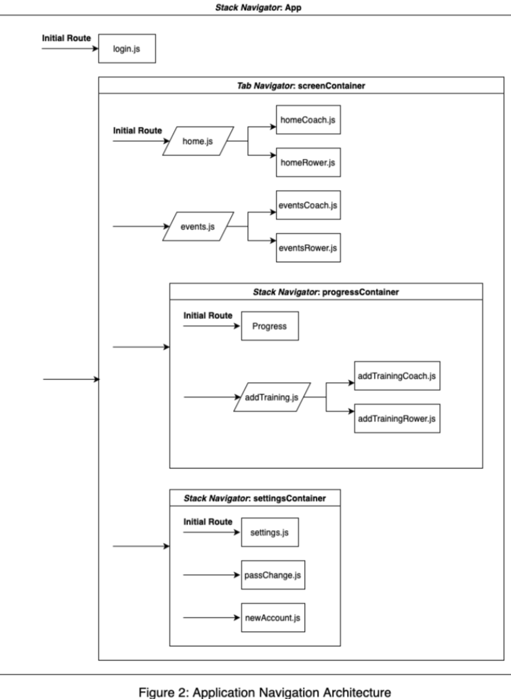
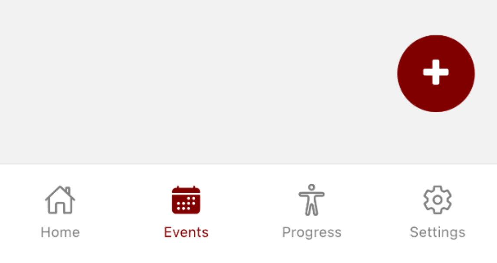

# Initial Development

[⇦Req Gathering](../requirement_gathering/requirementgathering.md) 

| Table of Contents                     |
|---------------------------------------|
| [Architecture](#architecture)                       |
| [Data Storage](#data-storage)   |
| [Navigation](#navigation)                 |

## Architecture
The final Rowing Club app is an application written using the React native framework, the application is comprised of 4 primary pages (Events, Home, Progress and Settings) with their respective variants catering to the user type and function required. Each of which is split into 2 types, one for the Coach and another for the Rower. The application source code also contains dependencies for necessary plugins and modules such as Expo Go, Firebase and version control files. Additionally, the source code contains specialised utility files like stylesheets, mains, and renderers.  

All the screens feature similar design principles such as a grey/cream/maroon colour scheme, which was inspired by the rowing team's original website, and a navigation bar at the bottom for navigating between the following screens: 

The first screen the user encounters is the home page which features 2 sections; one displaying the recent announcements and the second allowing the rowers to record their attendance status for their training sessions. The view is nearly identical to the rowers, having both a notification section and attendance section. However, they can add/delete announcements from the notification section and can filter my age group to see the availability of the rowers for that given group.

The events page features a view of all upcoming events such as competitions that are available to the rower given their age group. The coach however can view the events for all ages with a floating edit button to add/delete events and manipulate which ages receive the event popup.

The progress page serves as a place where the rower can upload an image of their workout progress which is then stored in the firebase storage, and they track their any improvements and progress over time as a chart showing their improvements is displayed. As for coach they can filter through the images provided by the users and write the results into categories to be sent to the database. They can also see the current best times of each of their rowers.

The settings page enables rowers and coaches to change their passwords and sign out of their accounts, Additionally, the coaches can add new users to the system. This is all handled through secure channels with firebase authorisation to protect sensitive information.  

## Data Storage
After establishing the fundamental framework of the program, we dedicated substantial time to learning and practicing Firebase. Initially, post-integrating Firebase dependencies, we encountered various issues, such as binary files not uploading to the database and erroneous data fetches due to synchronization problems. Addressing these, our backend development team members proactively scheduled collaborative sessions for discussion and solution brainstorming. Effective communication within the team was pivotal in continually resolving issues, propelling project progress, and maintaining consistent understanding and pace among members.  

Later, as we grew more accustomed to Firebase storage mechanisms, code conventions, and synchronization methods, our problem-solving became more adept. Ambitiously aiming for a seamless and efficient Firebase database interface, we have made significant strides, exemplified by the implementation of the progress page. It involves allowing users, as rowers, to capture/select and upload images to a Firebase Storage folder named after their user ID. Upon opening the progress page, the program fetches and orders documents matching the current user ID from the Firestore Database's TrainingData collection by timestamp. For coaches, the program retrieves all user-uploaded images and metadata from Firebase Storage, storing them as tuples in a local list variable. Stored images are displayed in a viewport, with a form for coaches to input rower's training data and upload related documents, including timestamps, uploader IDs, race types, and performance data, to the Firestore Database's TrainingData collection. In summary, the progress page's implementation highlights our team's autonomous problem-solving and programming prowess through comprehensive utilization of Firebase's storage and database modules. 

## Navigation
The rowing club application uses a navigation system to move between different states (pages) within the application. Figure 2 summarises the navigation system as an abstract diagram to better portray its architecture. The figure shows how the application utilises navigators and navigation containers to link and transition between different application pages.  

A navigation container is a file that imports the correct type of navigator and stores the pages that the navigator can transition between. In Figure 2, each navigation container is portrayed by rectangle with a header, showing the container file name and the navigator type. Inside each navigation container, arrows located on the leftmost are used to signify the different route (links to different pages) the navigator could take. As a navigation container isn’t an application page, they require a configuration to an initial route page, so that the application has an initial state to show the user when it launches. This is shown as a label on a route arrow. 

In the rowing club application, two types of navigators are used: 

Tab Navigator: This navigator is used to move between the four main application pages: home, events, progress, and settings. The navigator is used as the main navigator system for the application, as it provides a bottom navigation bar, with labels and symbols. This makes it is suited for non-linear transition between any two pages — precisely how users will be navigating between the main pages on the application. 

Stack Navigator: This navigator is used as inner navigation systems, for linear transition between pages. This is because the stack navigator has a memory feature, allowing users to transition back and forth between the pages. This is useful for pages such as addTraining, which is a sub-page that should only be accessed from the progress page, and can be transition back to progress page since the user completes adding new trainings. 

Pages are represented with rectangles, with the file names labelled on top of the shape. An arrow pointing into each page shows where the page is accessed from. These page files are used to store visual and functional elements for the application. However, some pages are ‘transitional pages’, and are not used to show an application state. Transitional pages are represented with slanted rectangle, and are the logic files used to call the correct type of page, depending on the user type the application is logged into. The reason for transitional pages is because coaches had different requirements for the application, thus, requiring different pages to allow for different functions. 
