# Coaches Prototype:

----------------------------------
[⇦Requirements](requirementgathering.md)

[⇦Older Rower Prototype](olderrowers.md) | [Parents Prototype⇨](parents.md)

The initial low fidelity coach prototype is outlines below with notes describing each of the screens
(for the interactive version of prototype please see the PowerPoint coachPrototype.pptx [Interactive Prototype](../imgs/Prototypes/coach/coachPrototype.pptx) in the imgs/Prototypes/coach folder)

    Simple log in page
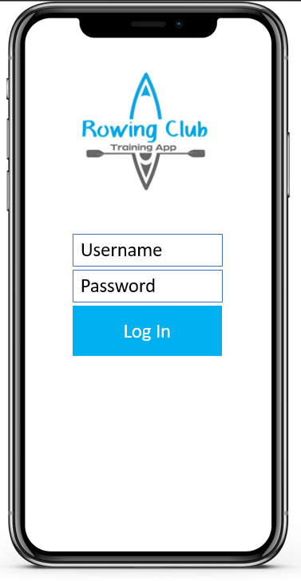

    Simple home screen to easily access different areas of the app
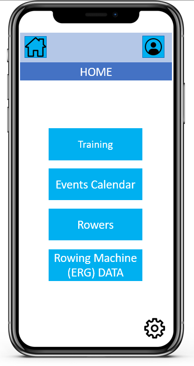

    Availability Calendar: will show what training sets will be done on each say +availability of rowers for each training set (unfinished: need to add edit view and view availability to see full availability of students)
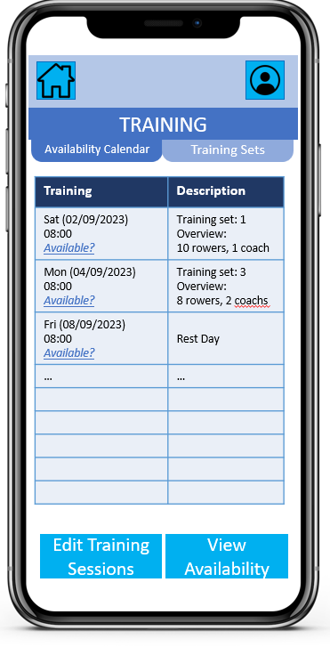

    Training Sets: where coach can make new sets. Can scroll through existing training sets, edit them, delete them and add more
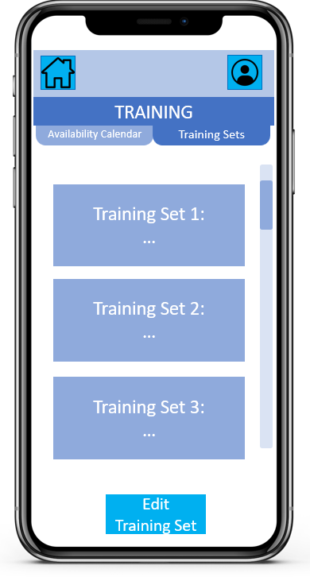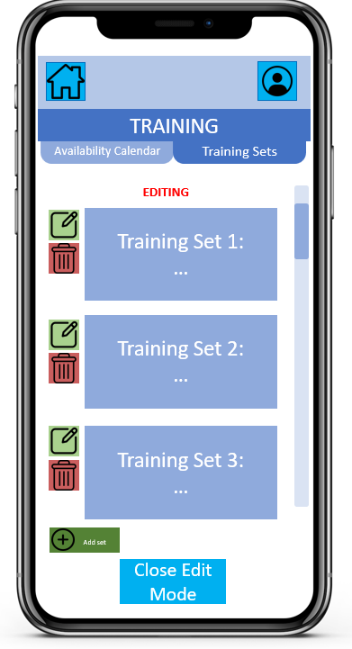

    Events Calendar: Display calendar as a list, with scroll bar. Coach has option to edit calendar; to edit existing events, delete events or add new events
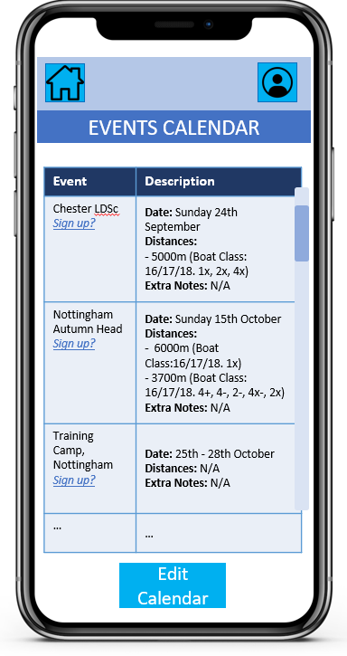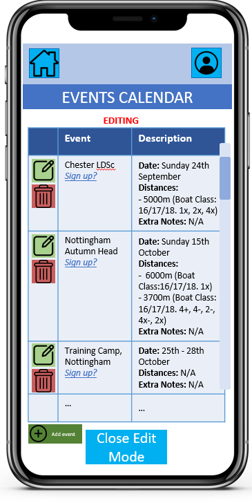

    Rowers: Coach is able to search for specific rowers to see thier profiles, PBs and other info
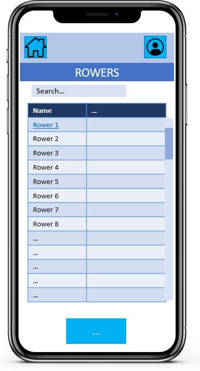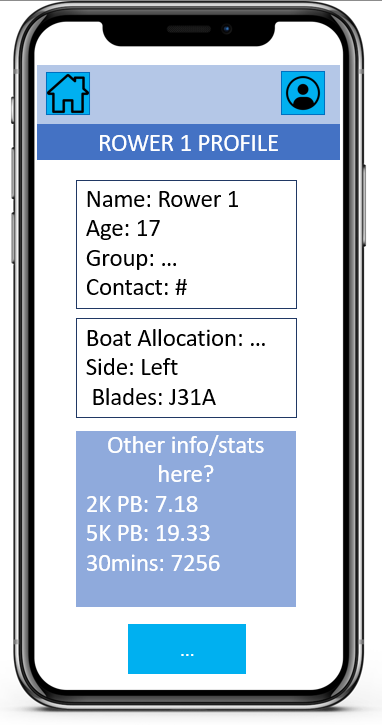

    Rowing Machine (ERG) Data: Can view the list of each training session by date and click on link to see the full database of times from the specific training session for all students. Has option to export the data so coach can analyse data
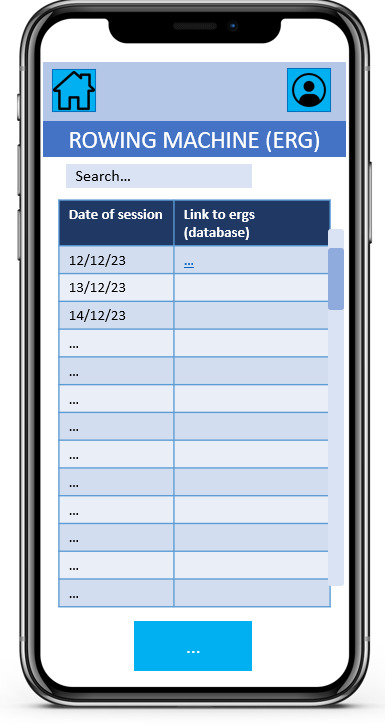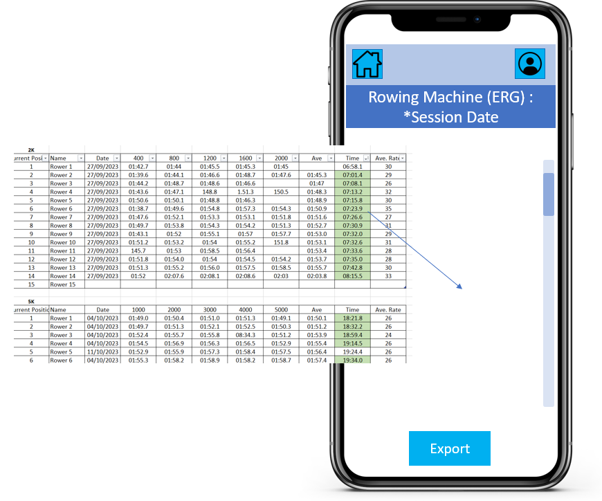

    Basic account page to view users personal details + logout
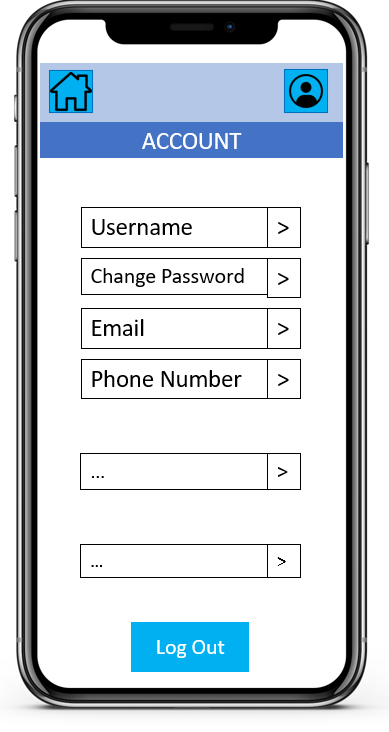