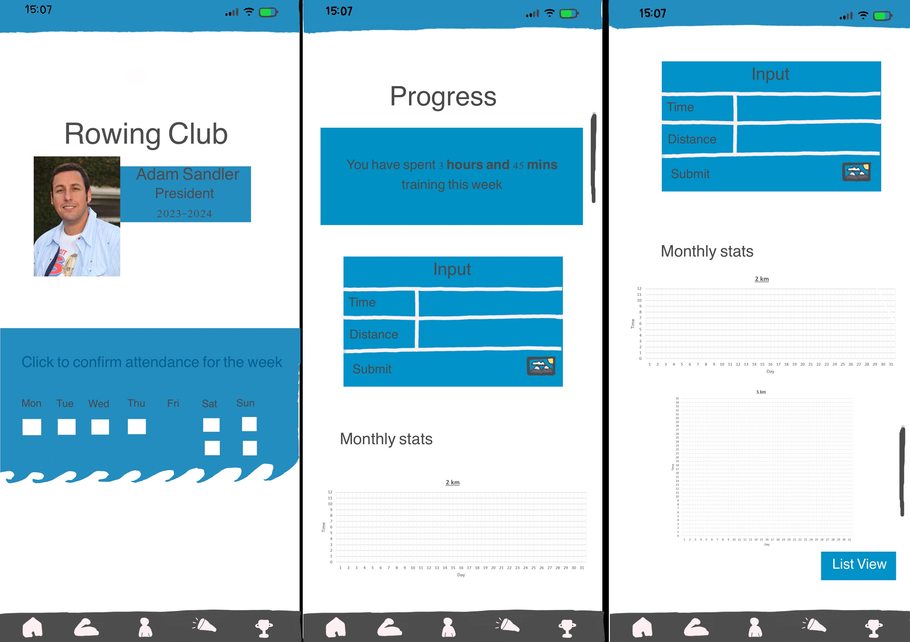

# Older Rowers:
----------------------------------
These low-fidelity prototypes depict different screens that could be implemented in the Rowing app for the Older Rowers.  

(Left to Right) Home screen, Progress input screen: 
The home screen has the president shown on the front screen with the confirmation of attendance for the upcoming week. 
 
The progress input screen allows rowers to input the time for the specific distance they rowed alongside an option to upload a picture of their training stats. The monthly stats section enables them to view their progress throughout the month they trained in a graph.

 

(Left to Right) Personal profile, Events screen and Scoreboard: 
The personal profile has the option to view their boat allocation for competitions / training and coach notes to view any comments the rowers' coach has for them.  
The events page has the option to view the upcoming rowing events.  
The scoreboard enables rowers to see their progress amongst their peers.

 

List view option for the Progress input screen. 
An alternative view to their monthly stats from graph view to table view instead.
