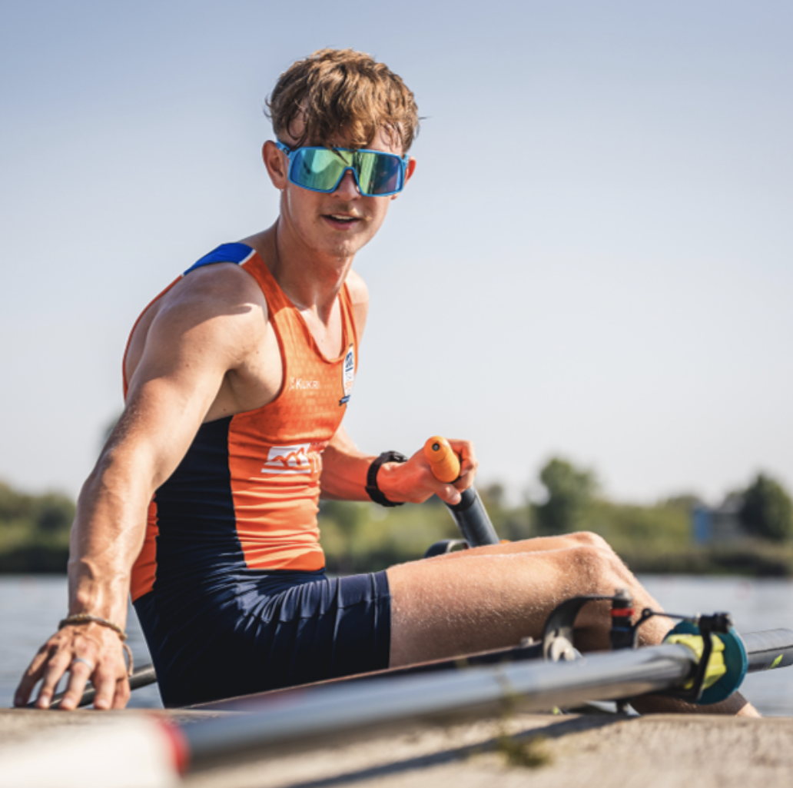
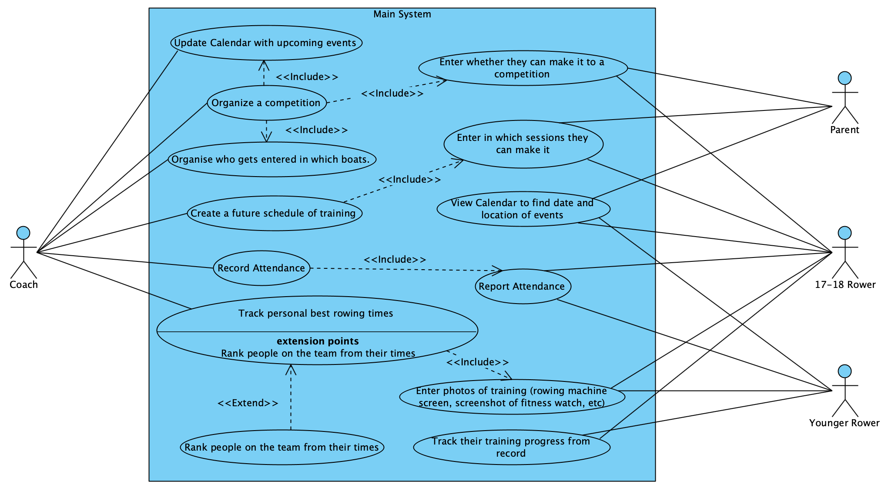

# Requirement Gathering

[⇦Readme](../README.md)

| Table of Contents                     |
|---------------------------------------|
| [Brief](#brief)                       |
| [Team Management](#team-management)   |
| [Reflection](#reflection)             |
| [Textual Analysis](#textual-analysis) |
| [Personas](#personas)                 |
| [Use Case Diagram](#use-case-diagram) |
| [User Stories](#user-stories)         |
| [Scenarios](#scenarios)               |
| [Prototypes](#prototypes)             |

## Brief

-----------------

[INTRO]

The diagrams we settled on producing are: personas, a use case diagram, user stories and scenarios. We also produced low fidelity screen prototypes for each user type.

*Personas*: As our application will include multiple user types, with each type having different function requirements, it is important for us to understand each of them, so that we can develop the app to includes functions fitting to each and every user. 
We did this through a persona board, so that we will be able to easily access information from each user type quickly during the development stages, 

*Use Case Diagram*: To ensure we are able to identify all the necessary functions for the application, we decided that a use case diagram will help us check what functions we actually need for our app. Furthermore, this will be useful when producing a product backlog.

*User Stories*: As we will be using user stories as specification points for our product backlog, it makes sense for us to work on it as part of our requirement gathering. This will allow us to easily check our app against a list of requirements, 
making it a lot easier to discover forgotten requirements or errors in the long run.

*Scenarios*: To be able to understand the systems in our application, we decided to use scenarios to grasp how the app features would work together, and how different users would use the application. 
This will help us in the development stages to integrate smaller functions together into the app.

*Low Fidelity Prototypes*: As we will be producing an application that requires a user interface, producing a prototype will allow us to map out where our elements will be, and how our screens may look like.
This will greatly reduce the time we spend on the user interface development as we will already have a plan on how to execute our idea.

## Team Management

-----------------
We managed the work by dividing into pairs...

## Reflection

-----------------
Add reflection here...

## Textual Analysis

In the process of textual analysis, actors and use cases were identified. We additionally noted a few requirements from the software that associated with the use cases of which the actors were linked to.
>Identifying the actors and use cases were essential for the rest of the requirements modelling stage, as it is what we will create diagrams based on.

Summary of the most important **Actors** and **Use Cases**:

## Personas

Knowing the specific needs of the apps users is essential to creating a good app, therefore we created a personas table to help us design specific features and functions for each user group.

Having all the personas can also help us later on when it comes to testing and validating the app against the requirements. By testing the app with users who fit each persona, we can ensure that the app is functional for each group. If it's not, we can make necessary adjustments.

Personas will also be essential to test and validate the app later in the software engineering process, as we will test the app with users that fit each persona to ensure the app is functional for each group.

| Persona                   | Coach                                                                                                                                                                                                                                                                                                                                                                               | Parent                                                                                                                                                                                                                                                                  | Junior Rower Organised By Parent                                                                                                                                                            | 17-18 Junior Rower Independent Of Parent                                                                                                                                                                                                                                        |
|:--------------------------|:------------------------------------------------------------------------------------------------------------------------------------------------------------------------------------------------------------------------------------------------------------------------------------------------------------------------------------------------------------------------------------|:------------------------------------------------------------------------------------------------------------------------------------------------------------------------------------------------------------------------------------------------------------------------|:--------------------------------------------------------------------------------------------------------------------------------------------------------------------------------------------|:--------------------------------------------------------------------------------------------------------------------------------------------------------------------------------------------------------------------------------------------------------------------------------|
| Name                      | Craig Willis                                                                                                                                                                                                                                                                                                                                                                        | Walton White                                                                                                                                                                                                                                                            | John Terry                                                                                                                                                                                  | Michael Anderson                                                                                                                                                                                                                                                                |
| Picture                   |                                                                                                                                                                                                                                                    |                                                                                                                                            |                                                      |                                                                                                                                                                                                                  |
| Job Title                 | Coach                                                                                                                                                                                                                                                                                                                                                                               | Pharmacist                                                                                                                                                                                                                                                              | Student                                                                                                                                                                                     | Student                                                                                                                                                                                                                                                                         |
| Relationship Status       | Married                                                                                                                                                                                                                                                                                                                                                                             | Married                                                                                                                                                                                                                                                                 | Single                                                                                                                                                                                      | Single                                                                                                                                                                                                                                                                          |
| Age                       | 57                                                                                                                                                                                                                                                                                                                                                                                  | 48                                                                                                                                                                                                                                                                      | 16                                                                                                                                                                                          | 17                                                                                                                                                                                                                                                                              |
| Gender                    | Male                                                                                                                                                                                                                                                                                                                                                                                | Male                                                                                                                                                                                                                                                                    | Male                                                                                                                                                                                        | Male                                                                                                                                                                                                                                                                            |
| Description               | Craig lives in Nottingham with his wife, he has two children (both of whom have moved away for university). He has a background in rowing from his childhood which he continues to pursue as a coach after retiring from his long term job at a geography teacher.                                                                                                                  | 5’11 White middle-aged man, Lives in Detached house in Radford, High-Income Business Owner, Family Man.                                                                                                                                                                 | John is a high school student with a passion for rowing. He loves to participate in various training sessions and competitions.                                                             | As a keen sportsman, Michael devotes his free time into training and body conditioning. He is gifted in rowing, and is one of the best junior rowers in the club.                                                                                                               | 
| Motivations               | To help both children and adults alike grow and learn, improving their rowing skills through training and partaking in competitions.                                                                                                                                                                                                                                                | He wants to see his child have a healthy hobby which helps them exercise, socialize and have fun.                                                                                                                                                                                                                                                                       | 1. To improve his rowing skills. 2. To prove his capabilities by participating in competitions. 3. To gain support and recognition from his parents.                                        | Michael has always loved rowing, and the community surrounding the sport. He wants to pursue rowing as a career, and must train intensively to qualify for it.                                                                                                                  |
| Expectations              | The ability to add events to a functional events calendar which all other user can see, and express interest in. To be able to create training schedules and keep track of rowers attendance. To see Images submitted by rowers and input them into a more formal data format. To track rowers PBs and rank them, and see each rowers progress.                                     | A User-Friendly App which needs minimal tech knowledge. Needs to be easy to use. Should have a calendar to track upcoming events with timing so he can pick up his children after practice, Should also be able to track if his child is progressing or not in the app. | 1. An easy-to-use software interface for competition registrations. 2. High security to ensure the safety of personal information. 3. Use basic functionalities without parents' permission | Michael requires a reliable app for storing and reviewing his ergometer records and time trials, as he feels like a standard health app is not specific enough to record his rowing training. He also wants an easy way to access the Club's set training plans from his phone. |
| Goals                     | Have a place where rowers will easily be able to see their progress and improvement, and input their rowing machine images without difficulty, to ensure there is more interaction from the rowers. And to ensure that Craig has all the information he needs available at the touch of a button.                                                                                   | He wants to be involved in his child’s hobbies and act as a parental figure. He will do this by driving his child to and from practices, attending events as well as tracking the child’s performance to provide encouragement and support.                             | 1. To win medals in regional and national competitions. 2. To gain enough skill and experience to participate in higher-level competitions in the future.                                   | Michael wants a future in professional rowing, therefore, his main drive is to keep pushing his limits, in order to qualify professionally. This includes attending available training sessions, and training to beat his current records.                                      |
| Environment and Knowledge | Craig has a background in rowing, learning it from the age of 13, and competing in competitions throughout university. As an adult he still rows recreationally and has an avid interest in helping others improve. He  was proficient in the old system of spreadsheets to keep track of data , however is less adept in using apps as he does not often use them to track things. | He has a medium understanding of using apps, and is not up to date with the latest technology. Has a medium powered android Mobile Device and a lower-end windows Laptop mainly used for spreadsheets and documents.  He prefers to use an app on his android mobile.   | 1. Grew up in a family supportive of sports. 2. Capable of using smartphones and computers for elementary tasks.                                                                            | Michael is familiar with how to a standard health app, as he currently uses one. He has a smartphone which he uses to access and make recordings of his training/time trials.                                                                                                   |

**Persona Priority**

Which persona has priority over other personas when creating the app? If so, why?

Coaches and both types of junior rowers are the primary users of our application, as they will be directly using it to enter information and record attendance. Therefore, their needs will be prioritised. On the other hand, parents are secondary users, as they will mostly use the application to receive information about competitions and training, but won't have many more interactions with the app.

Key Features discovered through analysis of personas:
- Log in system
- Events Calendar
- Training schedule (which rowers can show availability for)
- Image input for rowers
- ...
  (Further features are identified in the user stories.)

## Use Case Diagram

List assumptions and questions from use case diagram:
- ...
- ...
- ...

## User Stories
As a **role** I want **goal** so that **outcome**
(Write a few for each role? Then possibly rank by importance to create a clear req checklist?)

**COACH:**
- As a coach, I want to be able to update the update calendar with upcoming events so that rowers can sign up for them.
- As a coach, I want to have access to the rowers images of their rowing machine data after training so that i can input them manually into the system.
- As a coach, I want to be able to record rowers personal bests so that I can rank the people on the team for competitions.
- As a coach, I want to be able to make set training plans that rowers can access so that it is easier to see the activities rowers need to complete at training.

**PARENT:**
- As a parent, I want to receive real-time notifications about my child's attendance at rowing club practices and events so that I can stay informed about their commitment and safety.
- As a parent, I want to view a detailed progress report for my child's rowing performance, including metrics like speed, distance, and technique, so I can track their improvement over time and provide support as needed.
- As a parent, I want to easily access a calendar within the app that displays the dates and details of upcoming rowing competitions and events, so I can plan my schedule accordingly and be there to support my child during their races.
- As a parent, I want the app to provide a secure and private messaging feature that allows me to communicate with the rowing club coaches and other parents, ensuring I can get information and updates directly from the club's staff and engage with other parents.
- As a parent, I want to be able to record and review videos of my child's rowing sessions through the app, so I can provide constructive feedback and support their development as a rower.
- As a parent, I want the app to allow me to easily sign my child up for additional training sessions or workshops offered by the rowing club, so I can help them take advantage of extra opportunities to improve their skills and enjoy the sport even more.

**JUNIOR ROWER ORGANISED BY PARENT:**
- As a younger rower, I want to use basic functionalities without parent's permission so that I can check for upcoming events and competitions in advance before asking my parents' permission to participate.
- As a younger rower, I want to be able to sign up for events and competitions with my parents' permission so that I can participate in rowing events and improve my skills.
- As a younger rower, I want to have a progress report generated after participating every signed-up events so that I can keep track of my personal data, make schedule for my next training and see my progress intuitively.
- As a younger rower, I want to be able to use filters to filter out events with age restrictions or those that do not match my personal preferences so that I can browse the avaliable events of interest and make decisions more efficiently.
- As a younger rower, I want to have the displayed events sorted by date so that I don't need to see the events that are outdated.

**17-18 JUNIOR ROWER INDEPENDENT OF PARENT:**
- As an older rower, I want to be able to check upcoming events and sign up to competitions, so that I can quickly let my coaches know if I am available during those events.
- As an older rower, I want to be able to record my attendance from my phone quickly instead of waiting for the coach to check me in on a paper attendance sheet, so that I can quickly get started on warming up and getting my equipments ready.
- As an older rower, I want to visualise my improvement through a graph of records and scored times, so that I can easily check my improvements.
- As an older rower, I want to also have access to actual records of my times, so that I can view the precise timings that I should aim to beat.
- As an older rower, I want to be able to record in my own ergs times while doing individual training, so that I'm not required to go to my coaches and wait for them to manually enter the times into the spreadsheet.
- As an older rower, I want to be able to check myself against other club members on a scoreboard, so that I am motivated to compete against my teammates and stride to work harder.
- As an older rower, I want to be able to find weekly meetup information, such as practice times or meeting times for a 1-on-1 chat, so that I can plan ahead on when I need to be in for practice, and when I can have important chat with my coaches.
- As an older rower, I want to be able to mark myself as ill, so that I can easily let my coaches knows in advance that I cannot make it to training sessions.

## Scenarios
(structured description of a process: define a setting/context, define one or more actors/stakeholders, define goals/objectives, define a plot)

**COACH:**

**PARENT:**

**JUNIOR ROWER ORGANISED BY PARENT:**

Register for an event under parental supervision

*Context*

John uses a rowing club software to keep track of upcoming events and register for competitions.
He has specific preferences in terms of event types, distances, and locations.

*Scenario*

Logging In: John opens the rowing club software and logs into his account which is associated with his parents' account.

Accessing the Events Section: He navigates to the 'Events' section to see the upcoming rowing events or competitions.

Personal Preference Settings: John prefers to view events that are tailored to his level and interests. He taps on the 'Filter' button and selects options relevant to his preferences, such as 'Junior Level', '2000m Race', and 'Within 50 miles'.

Applying Filters: After applying the filters, the event list updates to show only those that match his specified criteria.

Sorting Options: John then uses the 'Sort' feature to sort the filtered events by date.

Registering for an Event: John browses through the events and selects an event happening next week, goes through the registration process, and sends a consent request to his parents for approval.

Confirmation: Once his parents approve, John receives a confirmation, and the event gets added to he and his parents' in-app calendar.

*Outcome*

John successfully finds and registers for a rowing competition that fits his preferences and skill level, thanks to the personalized sorting and filtering features of the software.

*Goal*

The scenario demonstrates how a junior rower under 17 can use the software to find and register for events that he's interested and valid, enhancing the user experience through personalized settings.

**17-18 JUNIOR ROWER INDEPENDENT OF PARENT:**

<ins>Reviewing Previous Ergometer Records</ins>

*Overview*

As a new season is about to begin, Michael is keen on training to improve his erg records. He is currently pre-season training independently at a gym close to home. However, he needs a way to keep track of how well he is doing each training session, in order to work out a maximised training approach for himself.

*Rationale*

Since Michael is training individually, he does not have his coaches to tell him whether he is getting better. He also wants to be able to quickly view records from his phone, rather than having to contact the coach for those information every time. Michael also likes having a more visual representation of his records, as it motivate him more than looking at pure numbers.

*Details*

1. Michael opened the application from his phone, right before a training session.
2. He clicked on the records page, and is met with a graph showing the timing of his rowing from the last month.
3. He could see that during this last month, Michael's times was steadily decreasing, meaning his trainings are effective.
4. Michael saw the dip on the graph, showing where his best time is, and clicked on the 'record history' button under the graph to see the exact timings of his best time.
5. He scrolled through the records to find his best time, and used that as his current time goal to beat.

*Notes*

Although Michael is currently only reviewing his erg records at the moment, he should be able to review other records such as his time trial records from his phone as well. He should also be able to input new times on the application, so that his records are up-to-date.

## Prototypes

--------------
* [Younger Rowers](../reqs/youngerrowers.md)
* [Older Rowers](../reqs/olderrowers.md)
* [Coaches](../reqs/coaches.md)
* [Parents](../reqs/parents.md)
