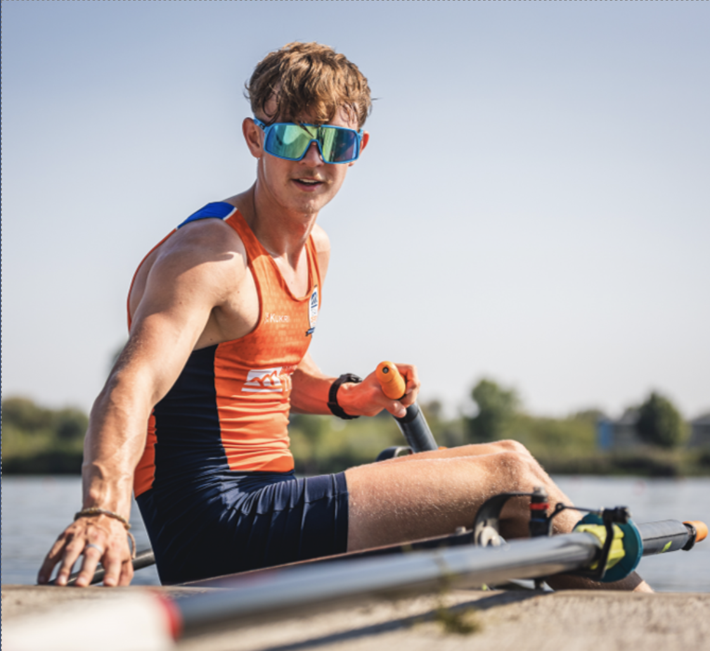

# Requirement Gathering

[⇦Readme](../README.md)

| Table of Contents                     |
|---------------------------------------|
| [Brief](#brief)                       |
| [Team Management](#team-management)   |
| [Reflection](#reflection)             |
| [Textual Analysis](#textual-analysis) |
| [Personas](#personas)                 |
| [Use Case Diagram](#use-case-diagram) |
| [User Stories](#user-stories)         |
| [Scenarios](#scenarios)               |
| [Prototypes](#prototypes)             |

## Brief

-----------------
Why we chose those specific UML diagrams, etc...

## Team Management

-----------------
We managed the work by dividing into pairs...

## Reflection

-----------------
Add reflection here...

## Textual Analysis

In the process of textual analysis, actors and use cases were identified. We additionally noted a few requirements from the software that associated with the use cases of which the actors were linked to.
>Identifying the actors and use cases were essential for the rest of the requirements modelling stage, as it is what we will create diagrams based on.

**TEXTUAL ANALYSIS HERE**

Summary of the most important **Actors** and **Use Cases**:

| Name | Type |
|:-----|:-----|
| ...  | ...  |

## Personas

Knowing the specific needs of the apps users is essential to creating a good app, therefore we created a personas table to help us design specific features and functions for each user group.

Having all the personas can also help us later on when it comes to testing and validating the app against the requirements. By testing the app with users who fit each persona, we can ensure that the app is functional for each group. If it's not, we can make necessary adjustments.

Personas will also be essential to test and validate the app later in the software engineering process, as we will test the app with users that fit each persona to ensure the app is functional for each group.

| Persona                   | Coach                                                                                                                             | Parent | Junior Rower Organised By Parent | 17/18 Junior Rower Independant Of Parent         |
|:--------------------------|:----------------------------------------------------------------------------------------------------------------------------------|:-------|:---------------------------------|:-------------------------------------------------|
| Name                      | Craig Willis                                                                                                                      | Walton White       |                                  | Micheal White                                    |
| Picture                   |  |        |                                  |  |
| Job Title                 | Coach                                                                                                                             | Pharmacist        |                                  |                                                  |
| Relationship Status       | Married                                                                                                                           |  Married      |                                  |                                                  |
| Age                       | 57                                                                                                                                |  48      |                                  |                                                  |
| Gender                    | Male                                                                                                                              |  Male      |                                  |                                                  |
| Description               | ...                                                                                                                               | 5’11 White middle-aged man, Lives in Detached house in Radford, High-Income Business Owner, Family Man.
       |                                  |                                                  |
| Motivations               | ...                                                                                                                               |        |                                  |                                                  |
| Expectations              | ...                                                                                                                               | A User-Friendly App which needs minimal tech knowledge. Needs to be easy to use. Should have a calendar to track upcoming events with timing so he can pick up his children after practice.
Should also be able to track if his child is progressing or not in the app.
       |                                  |                                                  |
| Goals                     | ...                                                                                                                               | He wants to be involved in his child’s hobbies and act as a parental figure. He will do this by driving his child to and from practices, attending events as well as tracking the child’s performance to provide encouragement and support.       |                                  |                                                  |
| Environment and Knowledge | ...                                                                                                                               | He has a medium understanding of using apps, and is not up to date with the latest technology. Has a medium powered android Mobile Device and a lower-end windows Laptop mainly used for spreadsheets and documents.  He prefers to use an app on his android mobile.       |                                  |                                                  |

**Persona Priority**

Which persona has priority over other personas when creating the app? If so, why?

Key Features discovered through analysis of personas:
- ...
- ...
- ...

## Use Case Diagram

[CREATE USE CASE DIAGRAM WHEN ALL PERSONAS DONE?]

List assumptions and questions from use case diagram:
- ...
- ...
- ...

## User Stories
As a **role** I want **goal** so that **outcome**
(Write a few for each role? Then possibly rank by importance to create a clear req checklist?)

COACH:

PARENT:

As a parent, I want to receive real-time notifications about my child's attendance at rowing club practices and events so that I can stay informed about their commitment and safety.

As a parent, I want to view a detailed progress report for my child's rowing performance, including metrics like speed, distance, and technique, so I can track their improvement over time and provide support as needed.

As a parent, I want to easily access a calendar within the app that displays the dates and details of upcoming rowing competitions and events, so I can plan my schedule accordingly and be there to support my child during their races.

As a parent, I want the app to provide a secure and private messaging feature that allows me to communicate with the rowing club coaches and other parents, ensuring I can get information and updates directly from the club's staff and engage with other parents.

As a parent, I want to be able to record and review videos of my child's rowing sessions through the app, so I can provide constructive feedback and support their development as a rower.

As a parent, I want the app to allow me to easily sign my child up for additional training sessions or workshops offered by the rowing club, so I can help them take advantage of extra opportunities to improve their skills and enjoy the sport even more.

JUNIOR ROWER ORGANISED BY PARENT:

17/18 JUNIOR ROWER INDEPENTANT OF PARENT:

## Scenarios
(structured description of a process: define a setting/context, define one or more actors/stakeholders, define goals/objectives, define a plot)

COACH:

PARENT:

JUNIOR ROWER ORGANISED BY PARENT:

17/18 JUNIOR ROWER INDEPENTANT OF PARENT:

## Prototypes

--------------
* [Younger Rowers](../reqs/youngerrowers.md)
* [Older Rowers](../reqs/olderrowers.md)
* [Coaches](../reqs/coaches.md)
* [Parents](../reqs/parents.md)
